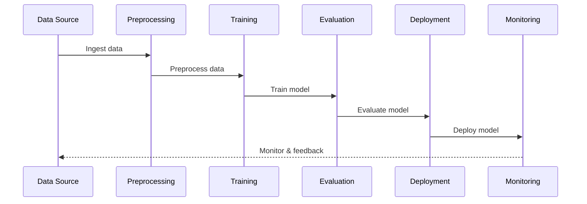

# Project Name

## Purpose
The purpose of this project is to implement a robust and scalable MLOps platform using AWS services such as SageMaker, EKS, and CodePipeline, enabling seamless machine learning lifecycle management from data ingestion to model deployment and monitoring.

## Scope
This project includes the setup and configuration of infrastructure as code, development of reusable ML components, and integration of automation pipelines for continuous integration and deployment.

## High-Level MLOps Architecture
The architecture leverages AWS services:

- **SageMaker** for model training and hosting
- **EKS (Elastic Kubernetes Service)** for container orchestration
- **CodePipeline** for continuous integration and deployment

The architecture addresses automation of the ML lifecycle, from data preprocessing to deployment and monitoring.

## ML Lifecycle Diagram
Below is a Mermaid sequence diagram outlining the ML lifecycle:



## Directory Layout
```plaintext
.
├── docs
│   ├── architecture
│   └── diagrams
├── infrastructure
│   ├── cdk
│   └── terraform
│       ├── environments
│       │   ├── dev
│       │   ├── prod
│       │   └── stage
│       └── global
├── mlops
│   ├── components
│   └── pipelines
└── src
    ├── inference
    └── training
```

## Automation Goals
- Automate the ML pipeline using AWS CodePipeline to enable CI/CD for ML models.
- Implement infrastructure-as-code with Terraform and CDK for scalable and maintainable cloud resources.
- Utilize SageMaker and EKS for efficient model training, deployment, and management.

